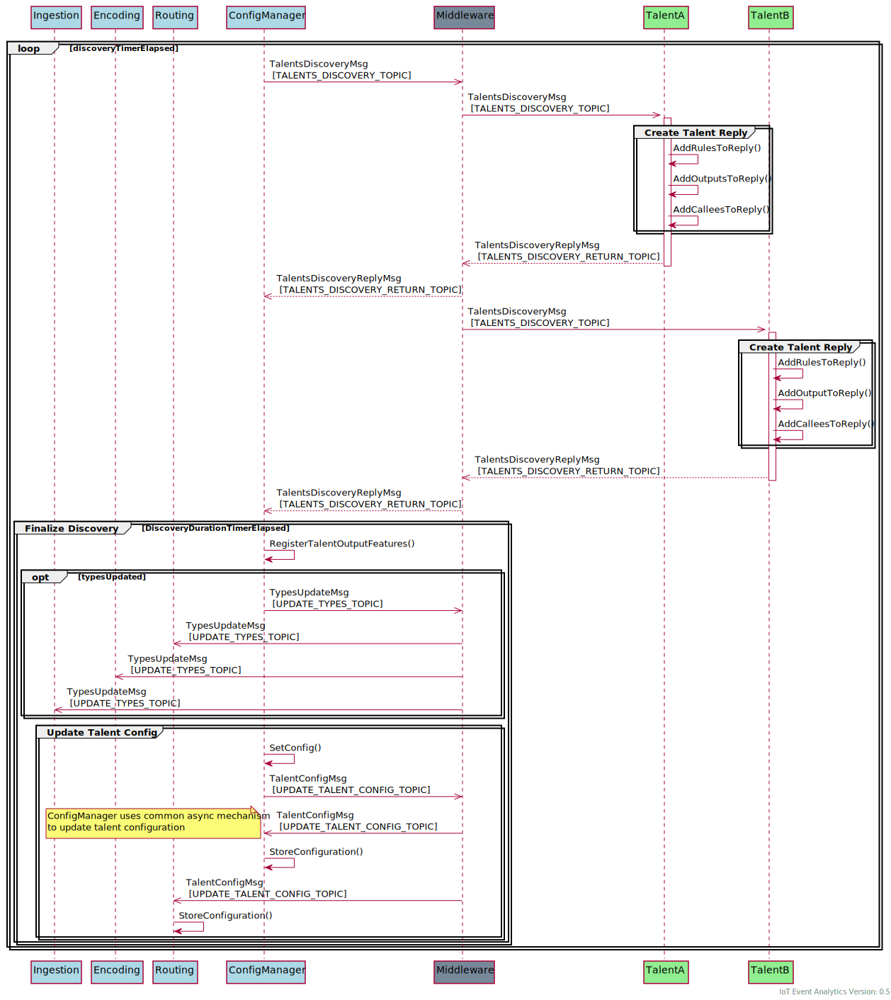
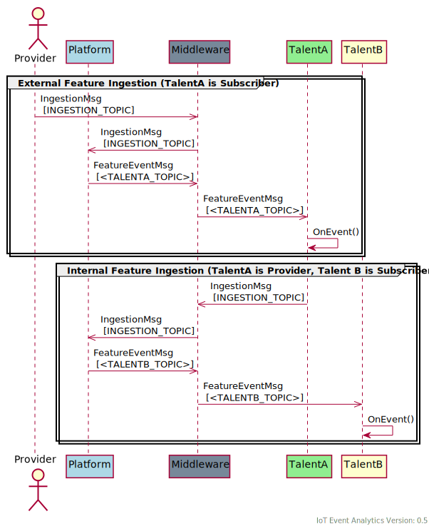

<!---
  Copyright (c) 2021 Bosch.IO GmbH

  This Source Code Form is subject to the terms of the Mozilla Public
  License, v. 2.0. If a copy of the MPL was not distributed with this
  file, You can obtain one at https://mozilla.org/MPL/2.0/.

  SPDX-License-Identifier: MPL-2.0
-->

# IoT Event Analytics Platform - Communication

## Overview of the Communication Stack

The diagram above shows a simplified communication stack of IoT Event Analytics.

The _Application Layer_ contains the Platform and Client which are using this platform to communicate but both are abstracted by a _ProtocolGatewayAdapter_ to provide the possibility to replace the underlying middleware.

The _Transport Layer_ shows _Mosquitto_ which is the default used Middleware (MQTT Broker). It could be replaced by other MQTT brokers or another middleware which has to provide a publish-subscribe mechanism (like MQTT) and requirements like latency, resource consumption and security mechanism (depending on the related project).

The _Physical Layer_ contains the supported transmission medium which could be _Ethernet_ for _Mosquitto_.

## Talent Discovery

The platform periodically runs a Talent Discovery to register new Talents with their provided and consumed (subscribed) feature events. Subscriptions happens via rules which are part of the _TalentConfig_.

In addition, Talents could subscribe to _PlatformEventMsgs_ and to the _TypesUpdateMsg_ to receive information about available _Talents_ and _Types_ (not shown in the diagram above).

## Feature Ingestion

An Ingestion of a feature event can be triggered by any client which has access to the middleware. It could be some adapter / bridge to integrate an existing system or it could be also a Talent which provides a feature at some time.

The main task fo the platform is to check, encode and enrich the ingested event with meta data (e.g. history, statistical values,...) and route them to the Talents which subscribes them via rules (e.g. "if feature a has been updated").

## Publish Subscribe Mechanism

The view above is simplified by:
 - _Ingestion_, _Encoding_ & _Routing_ are combined into _Platform_ (for the complete ingestion process see [Feature Ingestion](##Feature-Ingestion))

Publish-Subscribe from 'external' clients or by Talents are using the same mechanism. Inter-talent-communication would happen via Feature events but both Talents (in this case TalentA and TalentB do not know each other).

## Request Response Mechanism

The view above is simplified by:
 - _Ingestion_, _Encoding_ & _Routing_ are combined into _Platform_ (for the complete ingestion process see [Feature Ingestion](##Feature-Ingestion))
 - Talent Discovery has been break down to the registration of the request-response entities (for the complete discovery process see [Talent Discovery](##Talent-Discovery))
 - No recursive request-response shown

Depending on the use SDK the Talents hide the request-response handling behind a function call-facade. E.g. a return value of a call could be awaited in the caller (blocking) or fulfilled in a Future (non-blocking). The SDKs ensure that this request-response process is hidden for the _Talent_ developer.