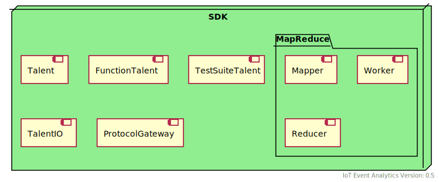

<!---
  Copyright (c) 2021 Bosch.IO GmbH

  This Source Code Form is subject to the terms of the Mozilla Public
  License, v. 2.0. If a copy of the MPL was not distributed with this
  file, You can obtain one at https://mozilla.org/MPL/2.0/.

  SPDX-License-Identifier: MPL-2.0
-->

# IoT Event Analytics Platform - Components

# Overview of Components

IoT Event Analytics consists of:

- [Platform Components](#Platform-Components)
- [SDK Components](#SDK-Components)
- [Plugins and Extensions](#Plugins-and-Extensions)

Please note that IoTEA uses several abstraction layers to provide flexibility in its deployment.
For further details see [IoT Event Analytics - Communication](./iotea-communication.md).

# Platform Components

These components build up the platform features like the communication incl. [_Talent_](#Talent) discovery, rule-based subscription, publish-subscribe and request-response (see [IoT Event Analytics - Communication](./iotea-communication.md)). These components can be freely deployed (e.g. any Node.js capable runtime, Kubernetes, via docker-compose).

These components are currently implemented in NodeJS and the interaction to clients is abstracted using a JSON-based protocol where the transport channel (default: MQTT) can be exchanged via [_ProtocolGateway_](#ProtocolGateway).

These components can be deployed on the edge device itself which reduces traffic to cloud (for [Talents](#Talent) running in the cloud) to minimum using [_ProtocolGateway_](#ProtocolGateway)-based routing.

## ConfigManager

The ConfigManager manages and provides the platform configuration. This is done statically via a configuration file (_config.json_).

The ConfigManager provides a periodic [_Talent_](#Talent) discovery and provides platform configuration (e.g. available _Types_ and _Features_) and dynamically via a periodic _Talent_ discovery. It holds the [_MetadataManager_](#MetadataManager) and [TalentConfigManager](#TalentConfigManager) master instances and synchronizes all other instances of them in the system.

## Ingestion

This component is used to transform and validate incoming events and configurable as an ETL-pipeline and supports an arbitrary amount of parallel ETL-pipelines via multi-channel. It is completely configurable via configuration files (json) and scalable by spawning multiple instances.

It validates value types (boolean, string, number, object, any) and _Types_ against metadata (e.g. using [_MetadataManager_](#MetadataManager)).

## Encoding

This component encodes incoming events by various encoders (minmax, delta, categorical) and it uses the InstanceManager to store an encoded field into the appropriate instance. It's scalable via multiple instances.

## Routing

This component routes the events to specific [_Talents_](#Talent) by evaluating their related rule-set. It's scalable via multiple instances.

## Sub Components

These components are used by the other platform components and act like helper or have been extracted to make them re-usable.

### MetadataManager

This component holds the definition of segments, feature and types and will be synchronized asynchronously using the underlying publish-subscribe protocol.

It synchronizes its internal state via publish-subscribe with all other InstanceManager instances.

### TalentConfigManager

This component holds the configuration of [_Talents_](#Talent) like the rules which are used to subscribe to _Feature_ events.

It synchronizes its internal state via publish-subscribe with all other InstanceManager instances.

### InstanceManager

This component keeps track of all instances of a given subject (An instance is a specific device of a specific type belonging to a specific segment). It provides a TTL for every field to simulate a rolling time window.

It synchronizes its internal state via publish-subscribe with all other InstanceManager instances.

### Rules

This component provides the following constraints:

- isSet, change, greater than, less than, ...
- time series constraints
- Nelson constraints

which can be hierarchically concatenated via AND / OR rules multiple times.

### ProtocolGateway

The ProtocolGateway abstracts the publish-subscribe protocol from a specific implementation of it. Therefore, a _ProtocolGatewayAdapter_ is used to integrate the underlying publish-subscribe communication (e.g. MQTT Broker).

This abstraction is not limited for platform components. It is the common way to abstract all communication between components of IoT Event Analytics.

For more information see [IoT Event Analytics - Communication](./iotea-communication.md).

# SDK Components

The SDK components are used to implement clients (which are called [_Talents_](#Talent)) for IoT Event Analytics.

SDKs are available for following languages:

- NodeJS
- Python
- C++
- (Experimental) NodeRed

**Note**: Not all SDKs share the same component structure, names and additional features.

## Talent

A _Talent_ is the implementation of a client application for Iot Event Analytics. It is programming language agnostic because only a JSON processing is required. SDKs in different languages are provided which provides needed processing and handling of messages focusing on the same look and feel for each _Talent_ implementation.

Features:

- Subscribes to _Feature_ events via [_Rules_](###Rules)
- Encapsulates business logic
- Can provide _Feature_ events
- Can call requests (provided by other Talents)
- Can be deployed in the cloud (e.g. Kubernetes, any Node.js capable runtime, via Docker-compose)
- Can be deployed on the edge device itself which reduces traffic to cloud (for cloud talents) to a minimum by using ProtocolGateway-based routing.
- Supports local and cloud talents (using FAAS like Lambda functions)
- Automatically syncs to cloud message brokers via ProtocolGateway

## Function Talent

A _Function Talent_ is an extension of a [_Talent_](#Talent) which can provide functions via request-response which can be 'called' by other [_Talents_](#Talent)).

## TalentIO

TalentIO provides an easy access interfaces for received messages and to prepare messages which will be send via IoT Event Analytics.

## TestSetTalent

This is a specialization of a [_Talent_](#Talent) which provides an simply API to implement and register integration tests by abstraction the underlying needed communication and functionality.

## Protocol Gateway

See [Protocol Gateway (Platform)](###ProtocolGateway).

## Map Reduce

Following Extensions of [_Talents_](#Talent) are available in several SDKs:

- Mapper
- Worker
- Reducer

# Plugins and Extensions

## VSCode Extension

The VSCode extension provides setup routines, auto-completion and other helpers to develop, test and run [_Talents_](#Talent).

Installation instructions and further information can be found [here](../../src/sdk/vscode/README.md).
