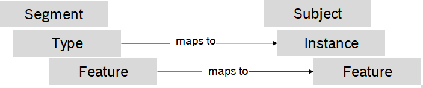
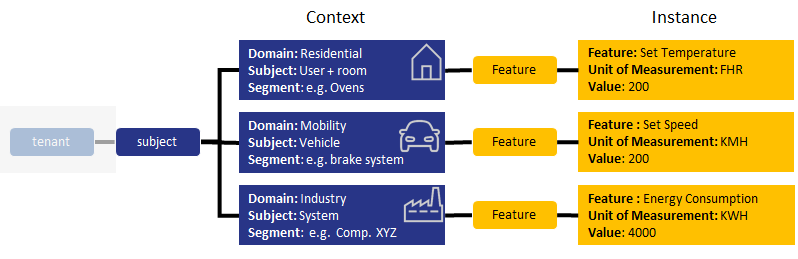
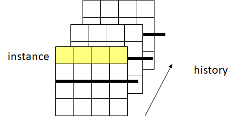
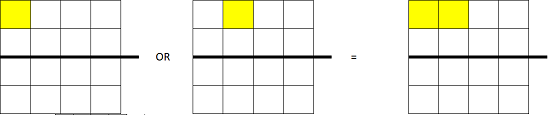

<!---
  Copyright (c) 2021 Bosch.IO GmbH

  This Source Code Form is subject to the terms of the Mozilla Public
  License, v. 2.0. If a copy of the MPL was not distributed with this
  file, You can obtain one at https://mozilla.org/MPL/2.0/.

  SPDX-License-Identifier: MPL-2.0
-->

# IoT Event Analytics Feature Engineering

80% of the [Machine Learning](./machine-learning.md) work is typically spent on data sourcing and feature engineering. IoT Event Analytics does the work for you.

## The ingestion

Due to the fact that IoT Event Analytics internally has a harmonized event representation an __E__ xtract-__T__ ransform-__L__ oad (ETL) flow is prerequisite, for transforming and validating the given data. These ETL flows are called __channel__. An good example is given for the [Eclipse Ditto input format](..\..\src\sdk\javascript\examples\basic\config\channels). If the __channel__ are not sufficient, the given __adapter__ concept supports to write transformations which require specific processing capabilities, compare [the Kuksa.val adapter](..\..\src\adapter\kuksa.val).

## The encoding

Encoding data is about bringing data into a different representation, having a huge impact on content semantic and model performance.

Each data point (aka signal) can be encoded in the following manner:

- "through", for pre-encoded values in the range [0..1]
- "minmax", for numeric values having a minimum and maximum value range e.g. temperature, speed
- "delta", for continuously rising or falling numeric values e.g. time, total energy consumption
- "categoric", for categorical values given in a enumeration of e.g. string values, boolean values, complex object values

The respective config file is the __types.json__. For example compare the [VAPP example](..\..\src\sdk\javascript\examples\integrations\vapp\config\types.json)

## Feature selection

Data points are the subject of events (aka messages). Within IoT Event Analytics an event looks like the following

```code
{ "subject": "<VIN>", "type": "Vehicle", "instance": "4711", "feature": "powertrain$speed", "value": 8, "whenMs": 1626566400000 }
```

__Note:__ A _segment_ and a _type_ can define features. A given _type_ inherits all features from the _segment_ it belongs to (Inheritance). An _instance_ is an instance of a given type, having all features from the _type_ and its_segment_.

## Metamodel


__Subjects__ represent the mathematically mapped instance e.g. a room, a plant (component), a vehicle (ECU), etc. Each __subject__ consists of related components/elements e.g. a vehicle has related functional domains e.g. steering, braking, powertrain, infotainment etc. These components are called __types__. Each segment consists of related instances belonging to a __type__ contained by the segment. e.g. a room __subject__ has multiple light bulb instances belonging to the same __segment__ but having a different type due to different models from different manufacturers. Each __instance__ consists of related __features__ e.g. brightness for light bulbs.



## Exemplary application



## Mathematical usage

Mathematically a single __instance__ (feature) is a vector. Multiple __instances__ form a matrix and the history of __features__ form a tensor.



## Programmatical rules and constraints

__Rule set__ like the following JavaScript one apply the afore described meta model

- Features are _foo_ and _bar_
- Type is _kuehlschrank0_, or _kuehlschrank1_
- Subject will be given by the incoming event

``` javascript
getRules() {
    return new AndRules([
        new Rule(
            new OpConstraint('foo', OpConstraint.OPS.GREATER_THAN, 0, `kuehlschrank0`, VALUE_TYPE_RAW)
        ),
        new Rule(
            new OpConstraint('bar', OpConstraint.OPS.GREATER_THAN, 0, `kuehlschrank1`, VALUE_TYPE_RAW, '', '^4712$')
        )
    ]);
}
```

Every __constraint__ offers __type__ and __feature__ selector which allow to select data from single __subjects__.

Both can be freely combined:

|  Type Selector   | Feature Selector | Semantic                  | Illustration                               |
|------------------|------------------|---------------------------|--------------------------------------------|
| \<segment.type\> | \<feature\>      | One specific feature      |   |
| \<type\>         | \<feature\>      | One specific feature      |   |
| \<type\>         | \*               | All feature of a type     |           |
| \<segment\>.\*   |                  | All types of a segment    |             |
| \*               |                  | All types of all segments |  |
| \*.\*            |                  | All types of all segments |  |

Since __segments__ and __types__ are technically both treated the same way, they both have to be unique and thus, \<segment\>.\<type\> and \<type\> will deliver the same results.

If for example multiple features should be selected, an __OrRule__ supports to connect two constraints. If only one constrained validates to true, all OR conntected features will be delivered in there last known _value_.



The code access, in a few examples, looks like:

``` javascript
ev.type,                                                // The type of the instance
ev.instance                                             // The id of the instance, the feature belongs to
ev.subject                                              // The id of the subject, the instance belongs to
ev.feature                                              // The name of the feature
ev.whenMs                                               // When did the current event happen as Unix timestamp in ms
ev.$feature.raw                                         // Raw value
ev.$feature.enc                                         // Encoded value
ev.$features.<type>.<feature>.$metadata.encoding.max    // Metadata for the given type and feature
ev.$features.<type>.<feature>.<instance>.$feature.raw   // Raw value as part of the selection matrix
```

Each __feature__ keeps four values

- The _raw_ value
- The _encoded_ value
- The _history_ of all previous values. The history can be restricted to a maximum kept amount of values. Per default the whole history is kept. Please be aware that this may be memory consuming.
- The _metadata_ including unit of measurement, multiplication factor to respective base unit, description
