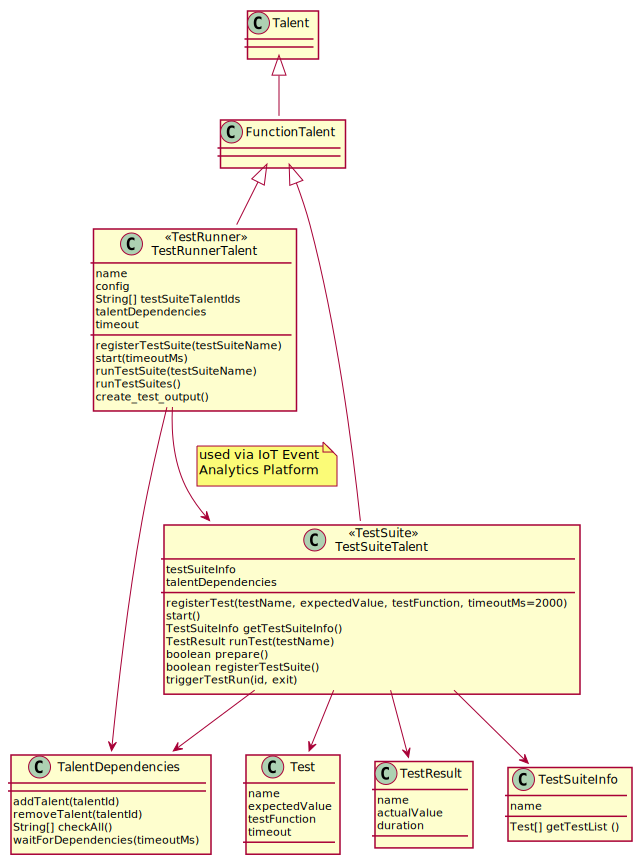
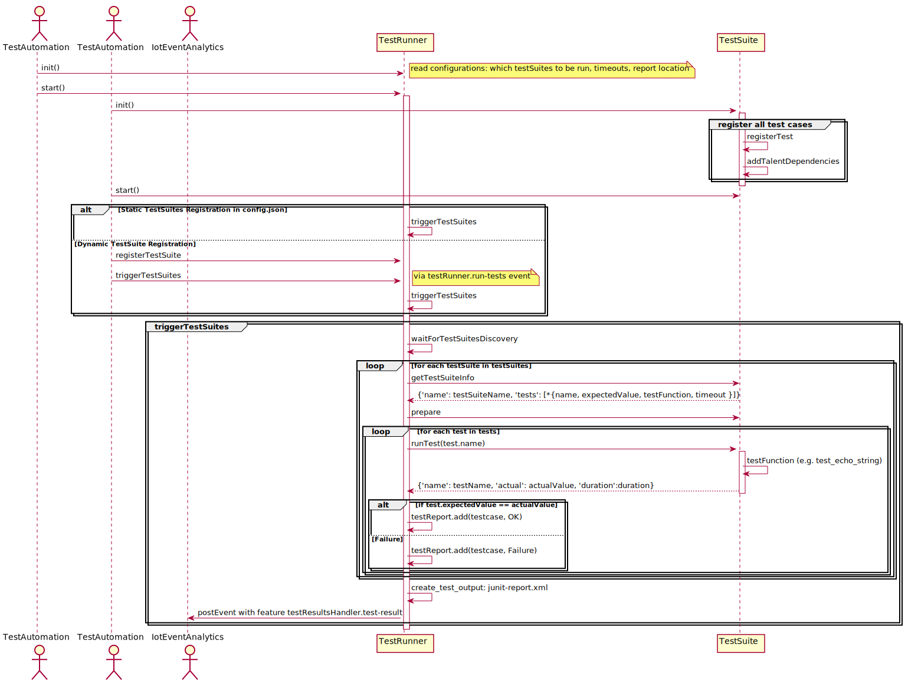

<!---
  Copyright (c) 2021 Bosch.IO GmbH

  This Source Code Form is subject to the terms of the Mozilla Public
  License, v. 2.0. If a copy of the MPL was not distributed with this
  file, You can obtain one at https://mozilla.org/MPL/2.0/.

  SPDX-License-Identifier: MPL-2.0
-->

# IoT Event Analytics - Integration Test Framework

## Overview

IoT Event Analytics has its own test framework. The idea behind this is to provide a single TestRunner and
multi-language TestSuites. The communication between the TestRunner and the TestSuites happens via
messages in the platform. The TestRunner starts the
execution of the TestSuites, receives the results from the execution and constructs the report.

## Components


The main players of the test framework are the TestRunner and TestSuites. There is a single TestRunner instance and
multiple number of TestSuites implemented as
talents in the IoT Event Analytics Platform. The TestSuites can be written in different languages, the ones currently
supported by the SDKs: javascript, python and cpp. The other components: TestSuiteInfo, TestDependencies, TestResult and Test
are utility classes, referenced by both the TestRunner and the TestSuites. 



The test framework classes are available in boschio.iotea.core package for all SDKs.

## Implementation of TestSuites
To create new test suites test developers would need to extend the TestSuiteTalent class and provide implementation of the test cases inside. The implementation includes:
  * registration of test metadata to IoT Event Analytics platform (e.g. `self.register_test('echoString', "Hello World", self.test_echo_string, 2000)`) 
  * adding talent dependencies which are referenced by the TestSuite (e.g. `self.talent_dependencies.add_talent('function-provider-py')`)
  * implementing the test case function addressing the test target, e.g.:
  ```    
    async def test_echo_string(self, ev, evtctx):
        result = await self.call('function-provider-py', 'echo',
                                 ['Hello World'],
                                 ev['subject'],
                                 ev['returnTopic'],
                                 500)
        return result
```
  * optionally overriding the prepare() method with additional setup code
  * optional: call TestSuite.register() and TestSuite.trigger_test_run() (triggerTestRun() in js sdk) to feed the test suite name into the
    TestRunner
    and trigger running the test cases. This is purposed for dynamic registration of test suites, e.g.:
    ```
    async def register_and_run(test_suites):
      for test_suite in test_suites:
          await test_suite.register()
      await test_suites[0].trigger_test_run()

    async def main():
      config = read_config('../../config/tests/python/config.json')
      test_suite1 = TestSuiteA(config, 'testSuite1')
      test_suite2 = TestSuiteB(config, 'testSuite2')
      test_suite3 = TestSuiteC(config, 'testSuite3')
        
      await asyncio.gather(
        test_suite1.start(), 
        test_suite2.start(), 
        test_suite3.start(), 
        register_and_run([test_suite1, test_suite2, test_suite3]))
    ```

## Interaction between the TestRunner and a TestSuite



## Configuration

### TestRunner

The TestRunner accepts a config.json file as input with the following test framework specific properties:
  * `testSuites`: a list of testSuite talent ids to be executed, e.g. `["testSuite-sdk-py", "testSuite-sdk-js"]`. This is an optional parameter for static feeding of testSuite names into TestRunner. ***An alternative option is to
    dynamically register testSuites using TestRunner and TestSuite APIs. TestRunner can either work with preconfigured
    testSuites in the config.json XOR dynamically registered via APIs.***
  * `outputFile`: where to store the junit xml report, only valid for python
  * `discoverDependenciesTimeout`: timeout in seconds to wait for the discovery of the talent dependencies
  * `logLevel`: the standard log levels: INFO, DEBUG, WARN, ERROR
  * `protocolGateway`: as defined in IoT Event Analytics.

### TestSuite

The TestSuite being a talent requires a standard config.json with protocolGateway connection properties to be able to
connect to the platform.

## Test Report

There are two implementations of the TestRunner: in javascript and python. The test report in the form of junit compatible xml document is only available by the python TestRunner. 

## Example

Here are the links to the integration tests of the javascript and python SDK test suites source code which can be used as reference
when implementing a test suite.

[Javascript SDK TestSuite](../../test/integration-tests/sdk-test-suites/javascript/testSuiteSDK.js)

[Python SDK TestSuite](../../test/integration-tests/sdk-test-suites/python/test_suite_sdk.py)

## Current Implementation of Integration Tests

Currently the IoT Event Analytics Platform comes with two implementations of TestRunner in javascript and python in [TestRunner Dir](../../test/integration-tests/runner). The
starting scripts and workflows use the python one as only it provides report output in standard junit xml format.

There are Test Suites for each of the supported languages located in [TestSuites
Dir](../../test/integration-tests/sdk-test-suites).

To be able to run the integration tests, it is necessary to start each of the dependency talents, e.g. for javascript
the following talents have to be started: eventTester.js, functionProvider.js, the test suite talent: testSuiteSDK.js,
and the TestRunner which is a single instance for all test suites.

Details about building and running the test cases are present [here, section 'Build & Run Integration Tests'](../../docker-compose/README.md).


