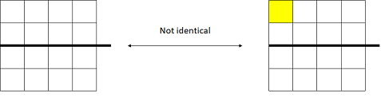

<!---
  Copyright (c) 2021 Bosch.IO GmbH

  This Source Code Form is subject to the terms of the Mozilla Public
  License, v. 2.0. If a copy of the MPL was not distributed with this
  file, You can obtain one at https://mozilla.org/MPL/2.0/.

  SPDX-License-Identifier: MPL-2.0
-->

# Machine learning

The foundation of the machine learning approaches is the given matrix/ tensor encoding of IoT Event Analytics. For further details compare the [feature engineering part](./iotea-feature-engineering.md)

With a given matrix it is quite easy to determine the identity. Identity is one core pillar of machine learning, because it helps to determine the distance and due to that do respective optimization steps (loss or gain based).

## Identity

A common distance function like the Euclidean distance (and *learned* one) can be applied on a whole latent __subject__ space.

If specific areas of the latent __subject__ space are excluded or pre-processed by specific kernel e.g. like the convolution of convolutional neural networks aka CNN higher semantical meanings could be applied.

A good example of a *learned* distance is given by [FaceNet](https://medium.com/analytics-vidhya/introduction-to-facenet-a-unified-embedding-for-face-recognition-and-clustering-dbdac8e6f02).

### Arithmetic

In addition to the identity arithmetical operations help to easily applied domain operations e.g. airing and cooking minus airing is cooking, AC-A=C.

### Connectivity

Besides the identity and arithmetic, specific distance functions could be activated on __feature__ level. For each feature a separate neural networks (NN) is learned. The NN topology is (pre-) determined by IoT Event Analytics. This feature e.g. helps to solve __feature__ connectivity issues; also compare the following [article](https://sakhawathsumit.github.io/sumit.log/2018/07/21/drawbacks-of-convolutional-neural-networks.html)

## Event sourcing

Often event processing struggle with sourcing multiple events into a consistent picture e.g.

- Multiple events describing a natural person e.g. event no. 1 containing the given name, event no 2. containing the family name, etc.
- Multiple CAN signals events representing one message e.g. in case of *J1939*, *ISO-TP*

IoT Event Analytics offers event sourcing out of the box. Just select the required __feature__ out of the event/ message history.

## Probability distribution

Besides the standard as well as learned distances, (probability) distributions help to make the identity less noise prone. For doing so, IoT Event Analytics out of the box supports to learn __subject__ and __type__ based VAE(GAN)s. VAEs encode the given input as distributions instead of simple points. This support to ensure continuity and completeness of the latent __subject__ space. Continuity (two close points in the latent space should not give two completely different contents once decoded) and completeness (for a chosen distribution, a point sampled from the latent space should give “meaningful” content once decoded). GANs could be optionally applied if less training data is available.

_Source:_ [article](https://medium.com/ai%C2%B3-theory-practice-business/understanding-autoencoders-part-ii-41d18d3ed9c1)

__Note:__ Also check the following [article](https://towardsdatascience.com/understanding-variational-autoencoders-vaes-f70510919f73)

## Statistical processes

Besides the commonly given properties of __feature__, statistical statements can be optionally activated. These statistical statements cover the classical STL decomposition as well as statistical statements like the Nelson (quality card) rules.

## Gaussian

Based on given data points the whole space is interpolated based on the Gaussian normal distribution. After the first (learned) interpolation each further given data point gets optional metadata information reflecting the:

- is outside 3 sigma
- uncertainty

__Note:__ Just calculate  1- uncertainty to get the probability.

### Statistical Process Control (SPC)

Statistical Process Control (SPC) uses statistical components of the given data to describe the characteristics of (natural) processes. For each __feature__ the SPC could be optionally enabled. if so all available rules will be evaluated and is matched marked in the _meta data_.

#### Terms

- Centerline: The arithmetic mean of the values = the expected value.
- Variance: A given values/points square-distance (aka absolute value) to the center line.
- Standard deviation: The standard error (aka 1 sigma) of a given values/point

#### Evaluated time series SPC rules

For the given _n_ last values the pattern of

- __nOut3Se__ as standard deviation of hit, with
  - 1 point
    - a) below __centerline__ – 3 x __standard deviation__
    - b) above __centerline__ + 3 x __standard deviation__
- __nOut2Se__ as standard deviation of hit, with
  - 2 out of 3 points (can be non-successive values)
    - a) below __centerline__ – 2 x __standard deviation__
    - b) above __centerline__ + 2 x __standard deviation__
- __nOut1Se__ as standard deviation of hit, with
  - 4 out of 5 points (can be non-successive values)
    - a) below __centerline__ – __standard deviation__
    - b) above __centerline__ + __standard deviation__
- __nBias__ as mean distance of hit from __centerline__, with 9 of 9 on the same side of __centerline__
- __nTrend__ as gradient of hit, with 6 out of of 6 increasing or decreasing values
- __nAlter__ as size of hit, with 14 alternating up and down the __centerline__
- __lowDev__ as standard deviation of hit, with 15 out of 15 between __centerline__ – __standard deviation__ and __centerline__ + __standard deviation__
- __highDev__ as standard deviation of hit, with 8 of 8 below __centerline__ – __standard deviation__ or above __centerline__ + __standard deviation__ either side

## Component Decomposition (aka STL)

### Evaluated statistical time series statements

For the given *n* last values the decomposition in

- trend
- season
- residual (aka noise)
- cumulative sum (CUSUM)
- exponentially weighted moving average (EWMA)

## Generic machine learning (ML) integration pattern

